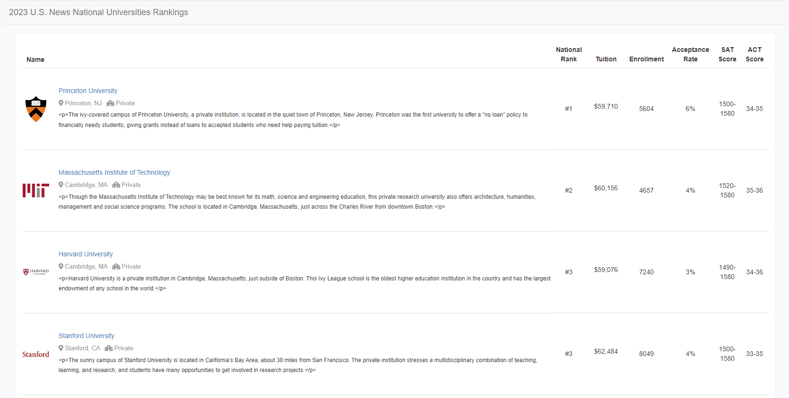

# USNewsBestColleges2023

## Description
This Go project consists of two parts:
* Part 1: a web crawler that crawls the universities and colleges in the United States by their ranks in 2023 with the US News API. It then stores the data in JSON files (`assets\data\`) according to the ranking categories, i.e. "National Universities", "National Liberal Arts Colleges", etc.
 The crawler also scrapes the logo of each university in the respective Wikipedia website and stores it in the `assets\img` path.
* Part 2: a web application with GIN web framework that displays the national universities in the JSON file in a user-friendly way. The website displays the universities in a table with the information such rank, name, logo, location, description, tuition, enrollment, and acceptance rate.

## Run the web application
1. Clone the repository
2. Run the web application with `go run main.go`
3. Open the browser and go to `localhost:8000`

## Screenshots

